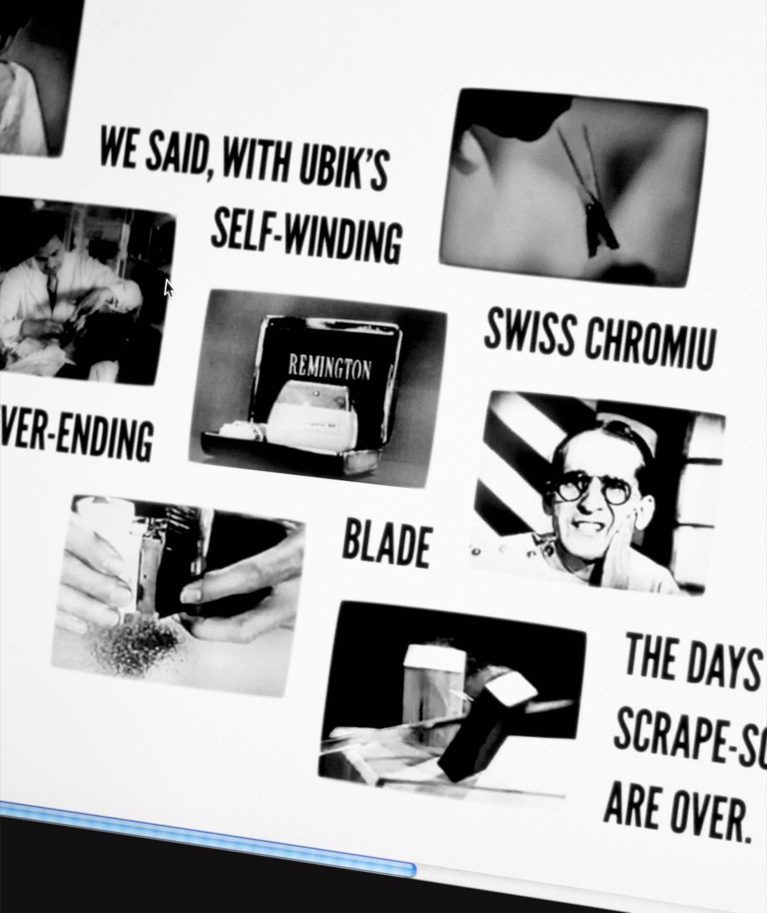

# *Ubik, Chap. 6*

*Ubik Chap. 6* is the second proof of concept prototype designed following the principles of [Medlay](http://ranbureand.github.io/medlay/ "Medlay / Hybrid media form concept") and it is based on the very first lines of chapter 6th of *Ubik* — a novel by Philp K. Dick.

> We wanted to give you a shave like no other you ever had. We said, it’s about time a man’s face got a little loving. We said, with Ubik’s self-winding Swiss chromium never-ending blade, the days of scrape-scrape are over. So try Ubik. And be loved.
> 
> Warning: use only as directed. And with caution.

*Ubik Chap. 6* is structured using HTML5, JavaScript, jQuery and CSS.

The source of the dynamic images used in this prototype is the [Prelinger Archives](https://archive.org/details/prelinger "The Prelinger Archives").

Here is a [link to the prototype](http://ranbureand.github.io/ubik-chap-6/ "Ubik, Chap. 6, prototype").